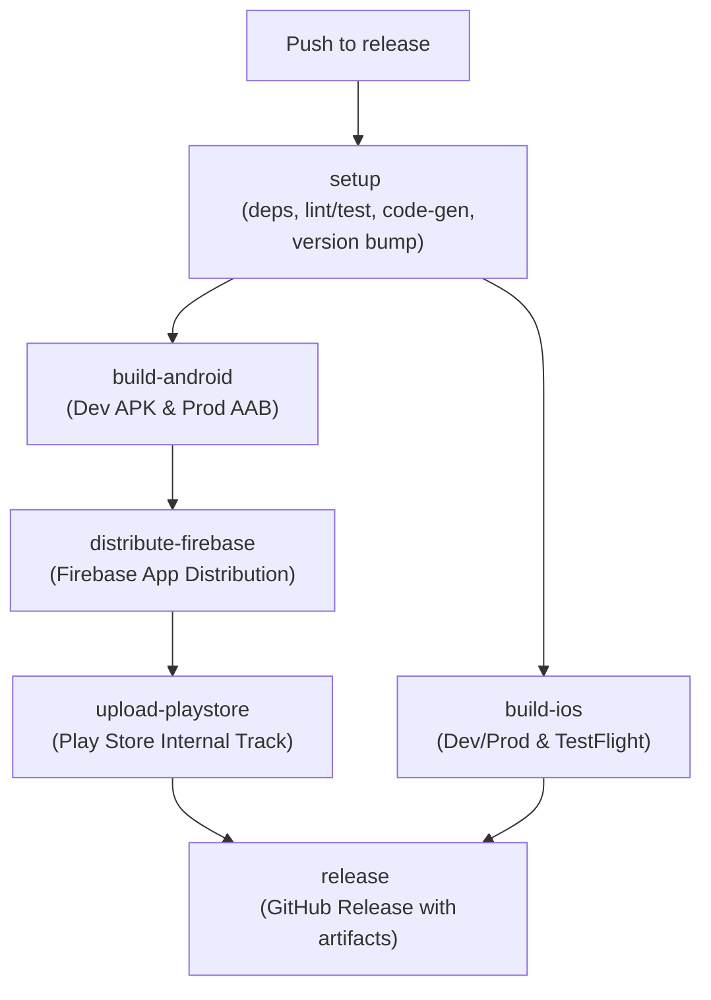

# 🚀 Flutter CI/CD — Unified Multi-Platform Release (iOS & Android)

This document explains how to set up, configure, and use the **`release.yml`** GitHub Actions workflow for your **Flutter Mobile** project.

---

## 📋 Overview

The workflow automates the full Android and iOS release pipeline whenever code is pushed to the `release` branch:



| Job | Purpose | Environment |
|-----|---------|-------------|
| `setup` | Increments version, resolves deps, runs tests/lints, `build_runner` | — |
| `build-android` | Builds Dev APK and Prod AAB | **Dev/Prod** (`.env` / `.prod.env`) |
| `build-ios` | Builds Dev and Prod IPA, uploads to TestFlight | **Dev/Prod** (`.env` / `.prod.env`) |
| `distribute-firebase`| Uploads APK to Firebase App Distribution | — |
| `upload-playstore`| Uploads AAB to Google Play Store (Internal Track) | — |
| `release` | Creates a tagged GitHub Release with zipped artifacts | — |

---

## ⚙️ Prerequisites

### 1. Android Keystore
Generate a release keystore and encode it to Base64 for the `KEYSTORE_BASE64` secret.

### 2. Apple Code Signing
You need an Apple Developer account with Distribution certificates and Provisioning Profiles for the main app and any extensions (e.g., Live Activities).
Encode the `.p12` certificate and `.mobileprovision` profiles to Base64.

### 3. Firebase & Play Store
- Firebase App ID and CI token for App Distribution.
- Google Play Store Service Account JSON for automated uploads.

### 4. GitHub Repository Secrets

Navigate to your repo → **Settings → Secrets and variables → Actions → New repository secret** and add:

| Secret Name | Description |
|---|---|
| `REPO_ACCESS_TOKEN` | GitHub PAT for updating repository variables (version bump) |
| `KEYSTORE_BASE64` | Base64-encoded `.jks` keystore file |
| `KEY_STORE_PASSWORD` | Keystore store password |
| `KEY_ALIAS` | Keystore key alias |
| `KEY_PASSWORD` | Keystore key password |
| `BUILD_CERTIFICATE_BASE64` | Base64 Apple Distribution `.p12` certificate |
| `P12_PASSWORD` | Password for the `.p12` certificate |
| `KEYCHAIN_PASSWORD` | Temporary password for the macOS runner keychain |
| `BUILD_PROVISION_PROFILE_BASE64` | Base64 provisioning profile for the main app |
| `BUILD_PROVISION_PROFILE_LIVE_BASE64` | Base64 provisioning profile for Live Activities |
| `APPSTORE_ISSUER_ID` | App Store Connect API Issuer ID |
| `APPSTORE_API_KEY_ID` | App Store Connect API Key ID |
| `APPSTORE_API_PRIVATE_KEY` | App Store Connect API Private Key |
| `FIREBASE_APP_ID` | Firebase Android App ID |
| `FIREBASE_TOKEN` | Firebase CI token |
| `PLAY_STORE_SERVICE_ACCOUNT_JSON` | Google Play Store Service Account JSON |
| `ANDROID_PACKAGE_NAME` | Android application package name |
| `DEV_ENV_FILE` | Full contents of the **dev** `.env` file |
| `ENV_FILE` | Full contents of the **prod** `.prod.env` file |

> [!NOTE]
> `DEV_ENV_FILE` and `ENV_FILE` must contain the **raw plaintext contents** of your environment files (do not base64 encode them). You can push them easily using the GitHub CLI:
> ```bash
> gh secret set DEV_ENV_FILE < .env
> gh secret set ENV_FILE < .prod.env
> ```

### 5. GitHub Repository Variables
Add these under **Settings → Secrets and variables → Actions → Variables**:
- `APP_V_MAJOR` (e.g., `1`)
- `APP_V_MINOR` (e.g., `0`)
- `APP_V_PATCH` (e.g., `5`)
- `APP_V_BUILDNO` (e.g., `42`)
- `FLUTTER_VERSION` (e.g., `3.41.3`)
- `IOS_TEAM_ID` (e.g., `JWAJ23K392`)
- `IOS_MAIN_PROFILE` (e.g., `App Distribution`)

#### CLI Command to initialize all variables:
Alternatively, you can run this single command to create all repository variables at once (replace value placeholders as needed):
```bash
for var in \
  "APP_V_MAJOR=1" \
  "APP_V_MINOR=0" \
  "APP_V_PATCH=0" \
  "APP_V_BUILDNO=1" \
  "FLUTTER_VERSION=3.41.3" \
  "IOS_TEAM_ID=JWAJ23K392" \
  "IOS_MAIN_PROFILE=App Distribution"
do
  gh variable set "${var%%=*}" -b "${var#*=}"
done
```

---

## 🔄 Triggering the Workflow

The workflow triggers **automatically** on every push to the `release` branch. 
It uses a `concurrency` group to ensure simultaneous pushes queue safely, preventing version bumping race conditions.

---

## 🧩 Key Design Decisions & Optimizations

### Modular Architecture
- **Reusable Workflows**: The pipeline is broken down into isolated `job_*.yml` workflows (located directly in `.github/workflows/`). The main `release.yml` serves purely as an orchestrator.
- **Composite Actions**: We extract repetitive tasks to `.github/actions/` to reduce boilerplate:
  - `setup-flutter-env`: Installs Java, Flutter, and handles all caching (`pub`, `cocoapods`, `DerivedData`).
  - `bump-version`: Evaluates and persists the new version to GitHub repository variables.
  - `report-failure`: Standardized issue creation and run cancellation.
  - `setup-env-files`: Injects `.env` and `.prod.env` files reliably across jobs.

### Extracted Scripts
- **iOS Signing**: Instead of inline YAML scripts, the complex `xcodeproj` logic is extracted to `scripts/configure_ios_signing.rb`. This makes it highly readable and testable.

### Quality Gates
- The `setup` job executes `flutter analyze --fatal-infos` and `flutter test`. If these fail, expensive mobile builds are preemptively skipped.

### ✨ Unique Pipeline Features

We implemented several advanced techniques to solve common Flutter CI/CD pain points. Below is a detailed look at the unique solutions in this pipeline:

#### 1. Stateful Versioning via GitHub Variables
**The Problem:** Traditional pipelines often increment versions by modifying `pubspec.yaml` and committing it back to the repository. This causes messy git histories, merge conflicts, and can trigger infinite CI loops.
<br/>
**Our Solution:** We completely decoupled the version from the repository files. We use GitHub Repository Variables (`APP_V_PATCH`, `APP_V_BUILDNO`) to track the state. 
During the `setup` phase, a script uses `gh variable set` (authenticated via a PAT) to increment these numbers. The workflow then injects them directly into the build tools using `--build-name` and `--build-number`. The repository remains pristine, and the version is always accurate.

#### 2. iOS Extension Version Syncing (Live Activities)
**The Problem:** Apple enforces strict rules that any App Extension (like iOS Widgets or Live Activities) must have the exact same `CFBundleVersion` and `CFBundleShortVersionString` as the main application. When Flutter builds an iOS app using `--build-number=X`, it *only* updates the main `Runner` target, leaving the extensions with mismatched versions (resulting in a TestFlight rejection).
<br/>
**Our Solution:** Right before executing `flutter build ipa`, the workflow explicitly runs Apple's native command-line tool, `agvtool`:
```bash
agvtool new-marketing-version "$VERSION_NAME"
agvtool new-version -all $BUILD_NUMBER
```
The `-all` flag forcefully synchronizes every nested target in the Xcode workspace to the exact version we need, completely eliminating TestFlight mismatch errors.

#### 3. Fail-Fast Workflow Cancellation
**The Problem:** By default, if you have parallel jobs running in GitHub Actions (e.g., Android and iOS building concurrently) and the iOS build fails, the Android build will *continue* to run for another 20 minutes, wasting expensive Action minutes.
<br/>
**Our Solution:** We implemented custom `if: failure()` steps at the end of critical jobs. If a job fails, it doesn't just fail silently—it creates a high-priority GitHub Issue tagging the developer, and then executes:
```bash
gh run cancel ${{ github.run_id }}
```
This API call tells GitHub to instantly abort the entire workflow run, immediately killing any sibling parallel jobs and saving valuable resources.

#### 4. Unified Dual-Environment Build
**The Problem:** Building Dev and Prod environments usually requires maintaining two separate pipelines, or running the pipeline twice, doubling the build time.
<br/>
**Our Solution:** We orchestrated a single pipeline that manages both concurrently. The workflow decodes the `DEV_ENV_FILE` and `ENV_FILE` secrets into local `.env` and `.prod.env` files on the runner. 
It then triggers parallel matrix builds (or sequential steps) injecting the correct variables using `--dart-define-from-file`. For Android, this yields a Dev `.apk` and a Prod `.aab` in a single run. For iOS, it builds and uploads the Dev and Prod `.ipa` files back-to-back, drastically reducing total deployment time.

---

## 🔍 Deep Dive: Jobs & Actions

To maintain clean code and prevent a massive 1,000-line YAML file, the pipeline is heavily modularized. Here is exactly what each component does.

### 🏗️ Jobs (`.github/workflows/`)

1. **`job_setup.yml` (Setup & Quality Gates)**
   - **Trigger:** Runs first.
   - **Action:** Triggers the `bump-version` action to calculate the next release version. It runs `flutter analyze` and `flutter test` to ensure code quality. It also runs `build_runner` to generate any missing code (like Freezed or JSON Serializable classes).
   - **Output:** Passes the `version_name` and `build_number` to all downstream jobs.

2. **`job_build_android.yml` (Android Build)**
   - **Dependencies:** Waits for `setup`.
   - **Action:** Uses the `setup-env-files` action to decode the base64 `.env` secrets. It configures the Java Keystore, builds a Development `.apk` (using `.env`), and a Production `.aab` (using `.prod.env`) in the same run.
   - **Artifacts:** Uploads the `apk` and `aab` to the workflow artifact storage for later jobs.

3. **`job_build_ios.yml` (iOS Build & TestFlight)**
   - **Dependencies:** Waits for `setup`.
   - **Action:** Installs Apple Distribution Certificates and Provisioning Profiles (both Main and Live Activities) into a temporary macOS keychain. It executes the `agvtool` extension version sync, builds the Dev `.ipa`, and uploads it via the App Store Connect API. It then cleans the build folder, builds the Prod `.ipa`, and uploads it.

4. **`job_distribute_firebase.yml` (Firebase QA)**
   - **Dependencies:** Waits for `build-android`.
   - **Action:** Downloads the Dev `.apk` artifact and pushes it to Firebase App Distribution so internal QA testers can test the new build immediately.

5. **`job_upload_playstore.yml` (Play Store Production)**
   - **Dependencies:** Waits for `build-android`.
   - **Action:** Downloads the Prod `.aab` artifact and pushes it to the Google Play Console (Internal Track) using a Service Account JSON key.

6. **`job_release.yml` (GitHub Release)**
   - **Dependencies:** Waits for ALL previous jobs to succeed.
   - **Action:** Zips the Android APK and AAB together with auto-generated release notes, creates a new Git Tag (e.g., `v3.0.16`), and publishes a GitHub Release.

### 🛠️ Composite Actions (`.github/actions/`)

Instead of repeating setup steps across every job, we created custom reusable "Composite Actions":

1. **`setup-flutter-env`**
   - **Purpose:** A single action that installs Java (Zulu 17), downloads the exact Flutter version, and manages aggressive caching for `~/.pub-cache` and CocoaPods to make subsequent builds blazing fast.
   
2. **`bump-version`**
   - **Purpose:** Connects to the GitHub API using a Personal Access Token (`REPO_ACCESS_TOKEN`). It reads the `APP_V_PATCH` and `APP_V_BUILDNO` variables, increments them mathematically, and writes them back to the repository settings so they persist forever without needing a git commit.
   
3. **`setup-env-files`**
   - **Purpose:** Securely reads the `DEV_ENV_FILE` and `ENV_FILE` Base64 secrets, decodes them, and writes `.env` and `.prod.env` into the runner's workspace so `--dart-define-from-file` can read them.
   
4. **`report-failure`**
   - **Purpose:** A fail-fast handler placed at the end of critical jobs. If `if: failure()` is triggered, this action creates a high-priority bug Issue on GitHub with the failure logs and executes `gh run cancel` to terminate any sibling parallel jobs instantly.

---

## 📁 Related Files

| File | Description |
|---|---|
| [`release.yml`](./release.yml) | The main CI/CD workflow orchestrator |
| [`job_*.yml`](./) | Reusable workflows for each platform/task |
| [`../actions/setup-flutter-env/action.yml`](../actions/setup-flutter-env/action.yml) | Flutter setup composite action |
| [`../actions/bump-version/action.yml`](../actions/bump-version/action.yml) | Version bump composite action |
| [`../../scripts/configure_ios_signing.rb`](../../scripts/configure_ios_signing.rb) | Xcode manual signing Ruby script |
| [`../../pubspec.yaml`](../../pubspec.yaml) | Flutter project dependencies |